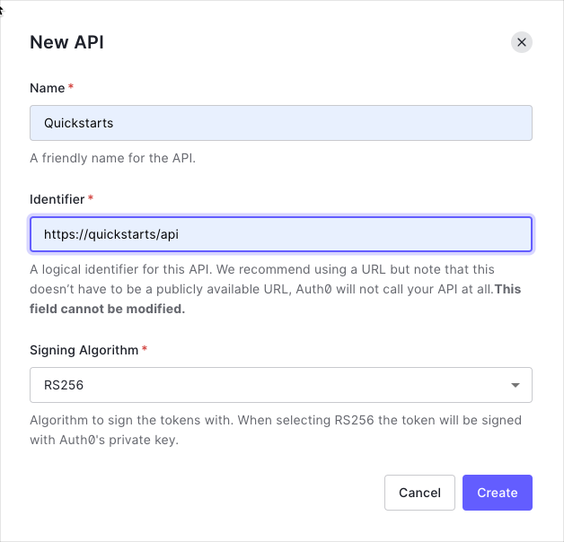

# Call an API

This tutorial will show the basics of how to get [Access Tokens](https://auth0.com/docs/secure/tokens/access-tokens) from [Auth0 SPA SDK](https://github.com/auth0/auth0-spa-js) to call APIs.

**NOTE:** To get the most out of this tutorial, you should have an API ready to be called - what we show here is how to call the API and set the Access Token correctly.

## Create an Auth0 API

For Auth0 to be able to issue Access Tokens for your API, you must create an API within your [Auth0 Dashboard](https://manage.auth0.com).

In the [APIs section](https://manage.auth0.com/#/apis) of the Auth0 dashboard, click **Create API**. Provide a name and an identifier for your API. You will use the identifier later when you're configuring your Javascript Auth0 application instance.

For **Signing Algorithm**, select **RS256**.



## Add the Audience

To request Access Tokens in JWT format from Auth0, you must specify the `audience` value in the SDK configuration. This value should be the identifier that was given in the previous section above.

Following on from the [previous tutorial](vue2-login.md), add your API Identifier value to the `audience` key in `auth_config.json` that we can then use when setting up the SDK:

```json
{
  "domain": "<YOUR AUTH0 DOMAIN>",
  "clientId": "<YOUR AUTH0 CLIENT ID>",
  "audience": "<YOUR AUTH0 API IDENTIFIER>"
}
```

Finally, open `main.js` and configure the Auth0 plugin with this audience value:

```js
// .. other imports

// NEW - import the audience
import { domain, clientId, audience } from '../auth_config.json';

// ..

Vue.use(Auth0Plugin, {
  domain,
  clientId,
  audience, // NEW - configure the plugin with the audience value
  onRedirectCallback: appState => {
    router.push(
      appState && appState.targetUrl
        ? appState.targetUrl
        : window.location.pathname
    );
  }
});

// .. more Vue configuration ..
```

## Call the API Using an Access Token

Modify the frontend Vue.js application to include a page that calls the API using an access token. Like the previous tutorial, you'll need to change the Vue router and add a new view with a button that calls the API.

Here we are using [Axios](https://www.npmjs.com/package/axios) as an example, but you can use any HTTP library that supports sending custom or authentication headers.

### Install Axios

Install the [`axios`](https://www.npmjs.com/package/axios) HTTP library, which will allow us to make HTTP calls out to the backend API:

```bash
npm install axios
```

### Add a new page

Next, create a new file `ExternalApi.vue` inside the `views` folder, and add a button to call the API.

Use the `getTokenSilently` method of the Auth0 wrapper to get an access token, and then use Axios to make the API call. Attach the access token to the call by setting it as the value for the `Authorization` header, as in the following example:

```html
<template>
  <div>
    <button @click="callApi">Call</button>
  </div>
</template>

<script>
  import axios from 'axios';

  export default {
    name: 'external-api',
    methods: {
      async callApi() {
        // Get the access token from the auth wrapper
        const token = await this.$auth.getTokenSilently();

        // Use Axios to make a call to the API
        const { data } = await axios.get('<YOUR API URL>', {
          headers: {
            Authorization: `Bearer <%= "${token}" %>` // send the access token through the 'Authorization' header
          }
        });
      }
    }
  };
</script>
```

### Checkpoint

Now you will be able to run the application, browse to the "External API" page and press the "Call" button. The application will make a call to your API endpoint. If the call authorizes correctly then no errors relating to authorization should be displayed in the console.

> For a deep dive into making secure calls to an API from Vue, visit the [Complete Guide to Vue User Authentication with Auth0](https://auth0.com/blog/complete-guide-to-vue-user-authentication/#Calling-an-API). This guide provides you with additional details, such setting up a sample Express API server and getting test access tokens from the Auth0 Dashboard.
